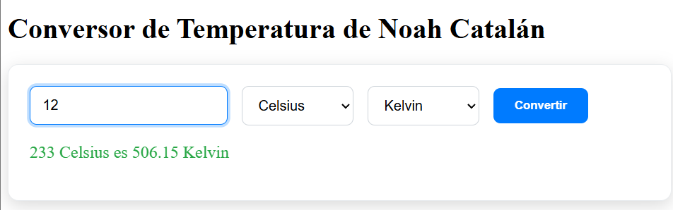

# Conversor de Temperatura de Noah Catalán

Este proyecto es una aplicación de conversión de temperatura desarrollada con Angular. El objetivo de esta práctica era levantar un proyecto existente, personalizar su apariencia y documentar el proceso.


## 1. Proceso de Puesta en Marcha

Para poder ejecutar el proyecto en un entorno local, se siguieron los siguientes pasos:

1.  **Instalación del Entorno**: El primer paso fue configurar el entorno de desarrollo. Al no tener Node.js ni npm instalados, se procedió a su instalación en Windows a través del gestor de paquetes `winget` en una terminal de PowerShell con privilegios de administrador.
    ```powershell
    winget install OpenJS.NodeJS.LTS
    ```
    Tras la instalación, se verificaron las versiones con `node -v` y `npm -v`.

2.  **Instalación de Dependencias**: Una vez con el entorno listo, y situado en la carpeta raíz del proyecto, se instalaron todas las dependencias necesarias con el comando:
    ```bash
    npm install
    ```

3.  **Ejecución de la Aplicación**: Finalmente, se levantó el servidor de desarrollo local de Angular para visualizar la aplicación en el navegador.
    ```bash
    npm start
    ```
    La aplicación se encuentra disponible en `http://localhost:4200`.

## 2. Cambios y Personalizaciones Realizadas

Una vez que la aplicación estaba funcionando, se procedió a personalizarla para darle una identidad propia.

### A. Cambio de Título

Se modificó el componente principal de la aplicación para que el título reflejara el autor de la práctica.

-   **Archivo modificado**: `src/app/app.component.ts`
-   **Cambio**: Se actualizó la propiedad `template` para cambiar el `<h1>` principal.
    ```typescript
    // Antes
    template: `<h1>Temperature Converter</h1><app-converter />`

    // Después
    template: `<h1>Conversor de Temperatura de Noah Catalán</h1><app-converter />`
    ```

### B. Rediseño de Estilos

Se realizó una refactorización completa de los estilos del componente conversor para lograr una apariencia más moderna y visualmente atractiva.

-   **Archivo modificado**: `src/app/features/converter/converter.component.scss`
-   **Cambios principales**:
    1.  **Creación de una Paleta de Colores**: Se definieron variables SCSS al inicio del archivo para gestionar los colores principales (`$azul-principal`, `$verde-exito`, etc.), facilitando futuros cambios.
    2.  **Contenedor Principal (`.card`)**: Se añadió un fondo blanco, una sombra más pronunciada y un sutil efecto de "elevación" al pasar el cursor por encima para darle profundidad.
    3.  **Campos de Formulario (`.field`)**: Se mejoró la interacción añadiendo un borde resaltado en color azul al hacer foco sobre ellos.
    4.  **Botón de Conversión (`.convert`)**: Se reemplazó el color negro por defecto por el azul principal de la paleta. También se definieron estilos claros para el estado `:hover` y `:disabled`.
    5.  **Texto de Resultado (`.result`)**: Se ajustó el tamaño de la fuente y se le aplicó el color verde de la paleta para indicar un resultado exitoso.

### Vista final


