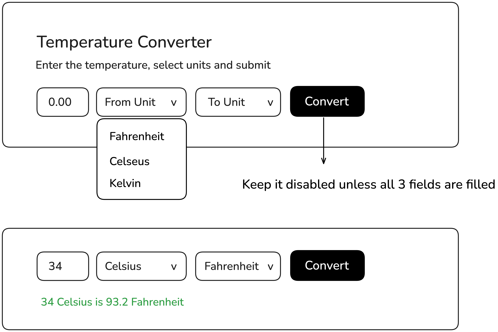
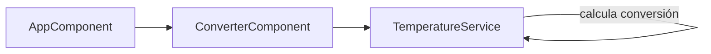

# Construcción de un Conversor de Temperatura en Angular

> Explicaremos conceptos básicos mientras construimos una aplicación sencilla.



---

## 1) Angular y el proyecto
- **¿Qué es Angular?** Un framework de JavaScript para construir aplicaciones web dinámicas. Usa componentes para organizar el código y facilita tareas como manejar formularios, datos y actualizaciones en tiempo real.
- **Objetivo de esta clase**: Construir un "Conversor de Temperatura" donde el usuario ingresa un valor, elige unidades (Celsius, Fahrenheit, Kelvin) y ve el resultado.
- **Por qué este proyecto?** Es simple pero veremos conceptos clave: componentes, servicios, formularios y validación. Usaremos el mockup como referencia visual.
- **Requisitos previos**: Tener Node.js instalado y npm que viene incluido.

---

## 2) Conceptos básicos de Angular
- **Componente**: Es como un "bloque de Lego" reutilizable. Tiene una plantilla HTML (qué se ve), estilos CSS (cómo se ve) y lógica TypeScript (qué hace). Ejemplo: nuestro `ConverterComponent` será el formulario.
- **Servicio**: Clases que manejan lógica específica, como cálculos. Son "inyectables" (Angular los proporciona donde se necesitan). Ejemplo: `TemperatureService` hará las conversiones.
- **Módulo**: Grupo de componentes y servicios. En Angular moderno, usamos "standalone components" (no necesitan módulos tradicionales).
- **Formularios reactivos**: Forma avanzada de manejar inputs. En lugar de leer valores manualmente, creamos un "formulario inteligente" que valida y controla el estado.
- **Inyección de dependencias (DI)**: Angular "inyecta" servicios en componentes automáticamente, como pasar herramientas a un médico.


---

## 3) Arquitectura del proyecto (alto nivel)
- **`AppComponent`**: El componente raíz (como la portada de un libro). Importa y muestra el conversor.
- **`ConverterComponent`**: El formulario donde el usuario ingresa datos y ve resultados.
- **`TemperatureService`**: Calcula conversiones (ej: Celsius a Fahrenheit).
- **Flujo**: El componente llama al servicio para convertir y muestra el resultado.



---

## 4) Scaffold: Crear el proyecto base
- Usamos Angular CLI (herramienta de línea de comandos) para generar el esqueleto.
- Comando para crear el proyecto (ejecutar en terminal):
```bash
npx -y @angular/cli@18 new temp-converter --directory . --standalone --routing=false --style=scss --ssr=false --skip-git --package-manager=npm --strict=false --interactive=false
```
- **Explicación**: Crea un proyecto llamado "temp-converter" con componentes standalone (modernos), sin rutas complejas, estilos en SCSS, y omite git inicial.
- Después, generar componentes y servicios específicos:
```bash
npx -y ng g component features/converter --standalone --style=scss --skip-tests=false
npx -y ng g service core/temperature --skip-tests=false
```
- **Qué genera**: Archivos como `converter.component.ts` (lógica), `.html` (plantilla) y `.scss` (estilos).


---

## 5) Implementación del servicio (`TemperatureService`)
- **Ubicación**: `src/app/core/temperature.service.ts`.
- **Propósito**: Manejar la lógica de conversión de temperaturas. Usa Kelvin como "unidad base" (fácil para cálculos).
- Código clave (explicado línea a línea):
```typescript
@Injectable({ providedIn: 'root' })  // Angular lo hace disponible en toda la app
export class TemperatureService {
  readonly units = ['Celsius', 'Fahrenheit', 'Kelvin'];  // Unidades soportadas

  // Método principal: convierte entre unidades
  convert(value: number, from: string, to: string): number {
    const k = this.toKelvin(value, from);  // Primero a Kelvin
    const result = this.fromKelvin(k, to);  // Luego desde Kelvin
    return Math.round(result * 100) / 100;  // Redondea a 2 decimales
  }

  private toKelvin(value: number, from: string): number {
    // Fórmulas simples: Celsius + 273.15, etc.
    switch (from) {
      case 'Celsius': return value + 273.15;
      case 'Fahrenheit': return (value - 32) * (5 / 9) + 273.15;
      case 'Kelvin': return value;
    }
  }
}
```
- **Por qué Kelvin?** Simplifica: solo 2 fórmulas en lugar de 6 combinaciones posibles.

**Nota**: Ejecuta pruebas manuales: "32 Fahrenheit debería ser 0 Celsius". Muestra cómo el servicio es reutilizable.

---

## 6) Implementación del componente (`ConverterComponent`)
- **Ubicación**: `src/app/features/converter/converter.component.ts`.
- **Propósito**: Crear el formulario reactivo para capturar datos y mostrar resultados.
- Código clave (con explicaciones):
```typescript
@Component({
  selector: 'app-converter',  // Nombre del componente en HTML
  standalone: true,  // No necesita módulo
  imports: [CommonModule, ReactiveFormsModule],  // Módulos necesarios
  templateUrl: './converter.component.html',
  styleUrl: './converter.component.scss'
})
export class ConverterComponent {
  form: FormGroup;  // El formulario "inteligente"

  constructor(private fb: FormBuilder, private tempService: TemperatureService) {
    // Crear formulario con validaciones
    this.form = this.fb.group({
      value: [null, [Validators.required, Validators.pattern(/^[-+]?\d*(?:\.|,)?\d+$/)]],  // Número requerido
      from: [null, Validators.required],  // Unidad origen requerida
      to: [null, Validators.required]     // Unidad destino requerida
    });
  }

  onSubmit(): void {
    const value = parseFloat(this.form.value.value.replace(',', '.'));  // Maneja coma como punto
    const from = this.form.value.from;
    const to = this.form.value.to;
    const output = this.tempService.convert(value, from, to);  // Llama al servicio
    this.result = { input: value, from, output, to };  // Guarda resultado
  }
}
```
- **Formularios reactivos**: En lugar de leer `input.value` manualmente, Angular maneja el estado y valida automáticamente.
- **Validación**: El botón se deshabilita si el formulario es inválido (ver plantilla HTML).

**Nota**: Patrón DI: "Angular pasa `tempService` automáticamente, como si fuera un parámetro invisible".

---

## 7) Plantilla HTML y estilos
- **Plantilla** (`converter.component.html`): Define qué se ve.
```html
<form [formGroup]="form" (ngSubmit)="onSubmit()">
  <input formControlName="value" placeholder="0.00" />
  <select formControlName="from">
    <option value="Celsius">Celsius</option>
    <!-- Más opciones -->
  </select>
  <select formControlName="to">
    <!-- Más opciones -->
  </select>
  <button type="submit" [disabled]="form.invalid">Convertir</button>
</form>
<div *ngIf="result">Resultado: {{ result.input }} {{ result.from }} es {{ result.output }} {{ result.to }}</div>
```
- **Explicación**: `[formGroup]` liga el formulario; `[disabled]` controla el botón basado en validación.
- **Estilos** (`converter.component.scss`): Haz que luzca como el mockup (bordes redondeados, botón negro).

---

## 8) Integración en `AppComponent`
- **Ubicación**: `src/app/app.component.ts`.
- **Propósito**: Mostrar el conversor en la página principal.
- Código simple:
```typescript
@Component({
  imports: [ConverterComponent],  // Importa el componente
  template: `<h1>Temperature Converter</h1><app-converter />`
})
export class AppComponent {}
```
- **Nota**: El componente raíz renderiza el conversor.

---

## 9) Pruebas y ejecución
- **Pruebas unitarias** (`temperature.service.spec.ts`): Verifica conversiones (ej: 0°C = 32°F).
- Ejecutar: `npm test` (usa Jasmine/Karma).
- **Levantar la app**: `npm start` → Ve a `http://localhost:4200`.
- **Demo**: Ingresa 100 Celsius → Fahrenheit (212). El botón se activa solo con datos válidos.

---

## 10) Problemas comunes y consejos
- **Error TS2729**: Solución: Usar getters para propiedades inyectadas.

---

## 11) Conclusión y próximos pasos
- **Lo aprendido**: Componentes, servicios, formularios reactivos, DI y validación en Angular.
- **Por qué funciona**: Cada pieza tiene un rol claro; el servicio es testable; el formulario controla el estado.
- **Próximos pasos**: Añadir más unidades o un historial.

**Próxima entrega**:  "¿Qué construirías ahora con Angular?" 